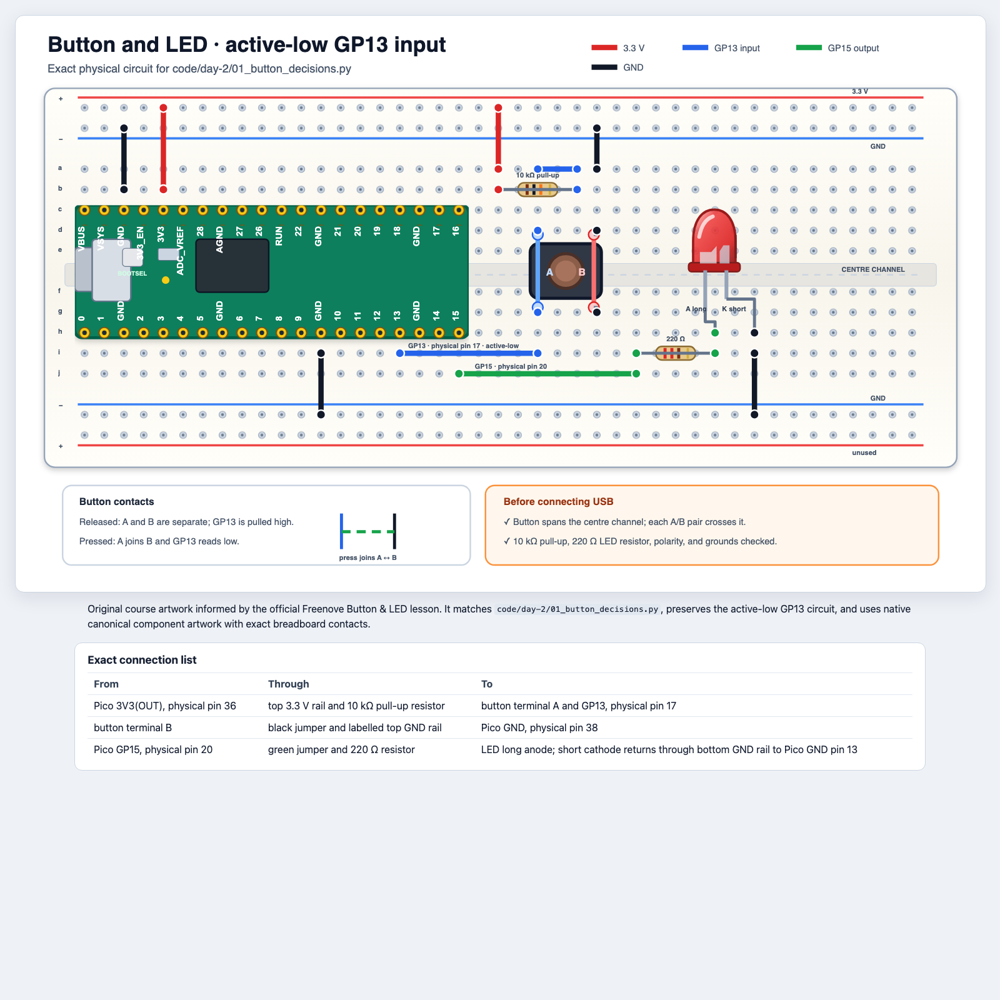
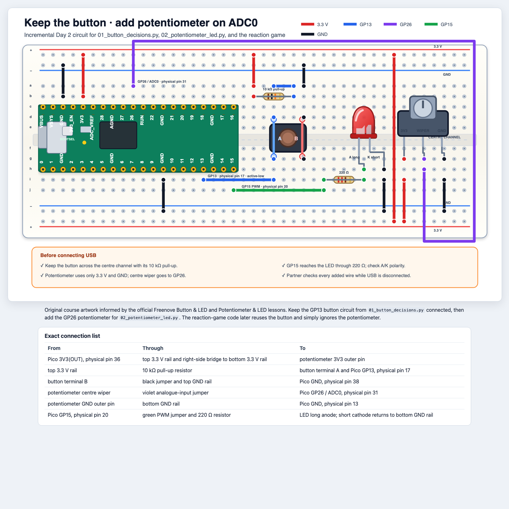

# Day 2: Make It Decide

## Mission

Turn physical input into decisions, then build a reaction-time challenge.

**Python:** Boolean values, comparisons, casting, `if`/`elif`/`else`, `while`,
lists, indexes, `append`, `len`  
**Hardware:** button, ADC, potentiometer, PWM LED  
**TEALS connection:** Unit 2, Data Types and Conditionals

## 1. A button is a Boolean question

Disconnect USB. Gather the tactile button, one 10 kΩ resistor, one 220 Ω
resistor, one red LED, and jumper wires.

[Open the course's scalable HTML wiring diagram](diagrams/button-and-led.html).
It shows the Pico connections, breadboard orientation, internal button
contacts, and pre-power checks.



Build in this order:

1. Match the Pico's USB-left orientation.
2. Place the button across the centre channel exactly as shown.
3. Add the 10 kΩ pull-up and 220 Ω LED resistor.
4. Add power, ground, GP13, and GP15 wires.
5. Read the HTML connection table aloud while a partner points to each hole.

A four-leg tactile button contains only two electrical terminals. The two blue
legs marked A in the diagram are always connected, and the two red legs marked
B are always connected. Pressing joins A to B.

Before connecting USB, use a multimeter in continuity mode if available:

1. Two legs in the same terminal should beep even when released.
2. One A leg and one B leg should not beep while released.
3. The A-to-B test should beep only while the button is pressed.

Rotating the button 90 degrees in the same holes can make the input appear
permanently pressed. If the program always prints `Pressed: True`, disconnect
USB and check orientation before changing the code.

Run [`code/day-2/01_button_decisions.py`](code/day-2/01_button_decisions.py).
The Freenove circuit is active-low:

```python
pressed = not button.value()

if pressed:
    led.on()
else:
    led.off()
```

`if` chooses one path when its Boolean condition is `True`; `else` chooses the
other path. The supplied `while True` keeps asking the button question until
you press Stop or `Ctrl+C`.

The 10 kΩ pull-up resistor makes GP13 read `1` while the button is released.
Pressing connects GP13 to ground, making it read `0`. `not` converts that
active-low electrical signal into a natural Python value: `pressed` is `True`
when a person is pressing the button.

Predict these expressions before trying them:

```python
pressed == True
not pressed
pressed and score > 0
pressed or time_is_up
```

## 2. From analogue world to numbers

A digital input has two states. A potentiometer can produce many values.
Disconnect USB and build the circuit below.

Open the
[scalable, accessible potentiometer-and-LED diagram](diagrams/potentiometer-and-led.html)
for exact breadboard contacts and the connection table.



Run [`code/day-2/02_potentiometer_led.py`](code/day-2/02_potentiometer_led.py).

The Pico reads a number from 0 to 65535:

```python
raw_value = knob.read_u16()
percent = int(raw_value / 65535 * 100)
```

Here `int(...)` casts a float to an integer. Record values near 0%, 25%, 50%,
75%, and 100%. Real measurements will not be exact.

PWM brightness uses a value from 0 to 65535:

```python
led.duty_u16(0)      # off
led.duty_u16(20000)  # dim
led.duty_u16(65535)  # full brightness
```

An `elif` adds another possible path. Python runs only the first branch whose
condition is true:

```python
if points >= 10:
    print("gold")
elif points >= 5:
    print("silver")
else:
    print("bronze")
```

### Threshold challenge

Change the program so the LED is:

- off below 20%;
- dim from 20% to 70%;
- bright above 70%.

Use `if`, `elif`, and `else`.

## 3. Lists remember several results

Try this in the Shell:

```python
times = [410, 375, 522]
print(times[0])
times.append(330)
print(len(times))
print(min(times))
```

Indexes start at zero. Predict what `times[-1]` returns.

## 4. A `while` loop repeats while a condition is true

A game must keep checking the button while it waits:

```python
while button.value():
    sleep_ms(1)
```

Read this as: “while the button is released, wait 1 ms and check again.” The
loop stops when `button.value()` becomes `0`. Unlike `while True`, this loop
has a condition that can become false.

The opposite wait uses `not`:

```python
while not button.value():
    sleep_ms(10)
```

Read this as: “while the button is pressed, wait until it is released.” Test
both loops with print statements before putting them inside the game.

Predict which loop is suitable for each job:

- keep the whole game running;
- wait until the button is pressed;
- repeat until five scores have been stored.

The reaction-game file also uses supplied timing tools such as `randint()` and
`ticks_ms()`. You may call those tools without knowing how they are built.

### Ready check before the game

Everything students must write in the baseline has now been practised:

| Game code | Where it was introduced |
|---|---|
| variables and assignment | Day 1 |
| active-low `button.value()` | Day 2, section 1 |
| `if`/`else` and comparisons | Day 2, sections 1 and 2 |
| `scores = []`, `append`, `len`, and `min` | Day 2, section 3 |
| `while` with a condition | Day 2, section 4 |
| calling supplied tools such as `sleep_ms()` | examples since Day 1 |

The baseline does **not** require `for`, `range`, `def`, dictionaries, or an
endless `while True` loop. Those ideas are either taught later or remain inside
provided scaffolding. `randint()`, `ticks_ms()`, and `ticks_diff()` are supplied
timing tools; students only use the call patterns listed below.

## Daily build: Reaction-Time Challenge

Rebuild the button and LED circuit. Start from
[`code/day-2/03_reaction_game_starter.py`](code/day-2/03_reaction_game_starter.py).
The starter supplies imports, pin setup, an empty `scores` list, and safe LED
cleanup. **You write the game.**

The first version is deliberately smaller than a commercial reaction game:
three rounds, no false-start detector, and two result categories.

### Step 1: write the plan as comments

Put these ideas in the correct order before writing Python:

- repeat until the score list contains three results;
- wait until the button is released;
- wait a random amount of time;
- turn on the LED and remember the start time;
- wait while the button is released;
- calculate the elapsed time and turn off the LED;
- add the result to the list;
- classify and print the result.

### Step 2: build one working round

Use the supplied tools:

- `randint(1000, 3000)` chooses the wait in milliseconds;
- `sleep_ms(wait_ms)` performs that wait;
- `ticks_ms()` records a clock reading;
- `ticks_diff(end, start)` calculates elapsed milliseconds.

Write and test one round before adding the outer game loop. The LED must turn
off after the press, and the Shell must print a believable reaction time.
Remember that this active-low button reads `1` when released and `0` when
pressed; use one `while` loop to wait for release and another to wait for the
press.

### Step 3: add a decision

Write your own `if`/`else`:

- below 350 ms prints `Quick!`;
- 350 ms or more prints `Keep practising!`.

Change the boundary after the first successful test and predict which results
will be classified differently.

### Step 4: turn one round into three

Wrap the working round in:

```python
while len(scores) < ROUNDS:
    # your tested one-round code goes here
```

This is a bounded loop, not an endless loop. It stops as soon as the list
contains three scores. The button-wait loops stop when the button changes
state.

Append each `reaction_ms` to `scores`. When the loop finishes, print the whole
list and the fastest result with `min(scores)`.

The supplied `try`/`except`/`finally` wrapper is safety scaffolding, not syntax
you must write today. Use
[`code/day-2/03_reaction_game_solution.py`](code/day-2/03_reaction_game_solution.py)
only for recovery or comparison after your three-round version works.

### Extensions

Choose one only after the baseline works:

- detect a press before the LED and report a false start;
- calculate the average with `sum(scores) / len(scores)`;
- add a third result category with `elif`;
- celebrate a personal best;
- increase the game to five rounds;
- create a two-player version.

The optional
[`code/day-2/03_reaction_game_extension.py`](code/day-2/03_reaction_game_extension.py)
shows one possible false-start implementation after students have designed
their own.

### Demo checklist

- Show one complete timed round.
- Show all three stored scores.
- Explain why the main program needs a `while` loop.
- Point to the Boolean expression that ends a wait.
- Explain why each score is an integer.

## Exit ticket

Write a condition that is true when `reaction_ms` is at least 200 and below
500. Then describe what values lie exactly on each boundary.
