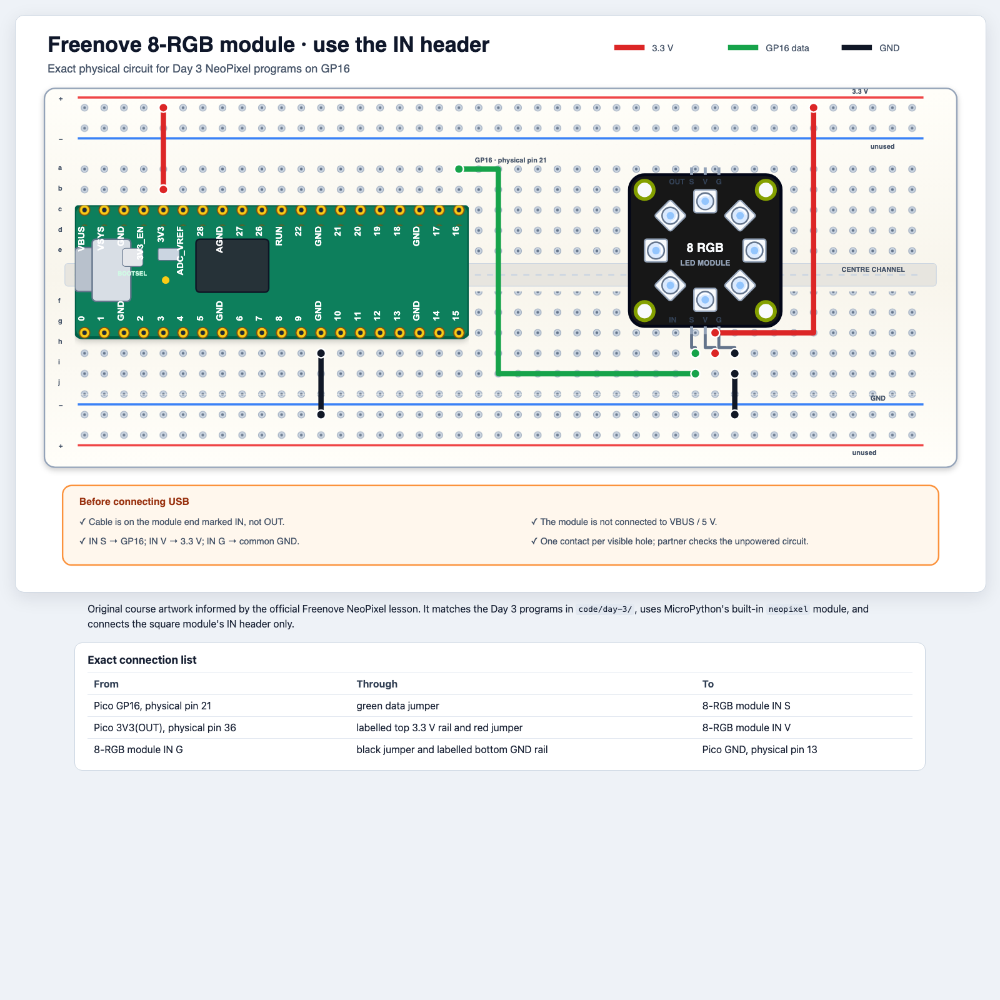

# Day 3: Make It Reusable

## Mission

Organise repeated code into functions and bring eight RGB pixels to life.

**Python:** imports, functions, parameters, return values, lists, tuples,
`for`, `range`, indexes, nested loops, local variables  
**Hardware:** Freenove 8-RGB LED module, potentiometer  
**TEALS connection:** Unit 3 Functions and Unit 4 Nested Loops and Lists

## 1. Meet the RGB module

Disconnect USB and follow the
[8-RGB wiring table](WIRING_AND_SAFETY.md#freenove-8-rgb-led-module).

Open the
[scalable, accessible 8-RGB module diagram](diagrams/rgb8-module.html) and use
the module header marked `IN`.



The official
[Freenove NeoPixel lesson](https://docs.freenove.com/projects/fnk0063/en/latest/fnk0063/codes/Python/6_NeoPixel.html)
uses a custom library. Our code uses MicroPython's built-in `neopixel` module,
so no extra file is required.

Run [`code/day-3/01_neopixel_colours.py`](code/day-3/01_neopixel_colours.py).

An RGB colour is a tuple of red, green, and blue values:

```python
RED = (30, 0, 0)
GREEN = (0, 30, 0)
BLUE = (0, 0, 30)
```

Keep values low; `255, 255, 255` is unnecessarily bright.
The first program repeats the same fill-write-print-sleep pattern for each
colour. Leave that repetition visible for now; the next sections show how
functions and loops improve it.

## 2. Functions name reusable jobs

You have already called built-in and hardware functions such as `print(...)`,
`sleep_ms(...)`, and `pixels.fill(...)`. An **argument** is a value supplied
inside the parentheses.

A user-defined function starts with `def`:

```python
def level_to_colour(percent):
    if percent < 33:
        return (0, 0, 25)
    return (0, 25, 0)

colour = level_to_colour(20)
```

`percent` is a parameter: the local name that receives an argument. `return`
sends a value back to the calling code. It does not print the value.

Try this smaller function in the Shell before editing an animation:

```python
def doubled(number):
    return number * 2

print(doubled(4))
```

## 3. A `for` loop visits each item or index

First print a known sequence:

```python
for index in range(8):
    print(index)
```

`range(8)` produces 0 through 7. The indented line runs once for each value,
and `index` stores the current value. Those are exactly the valid pixel
indexes.

Now apply that loop to the hardware:

```python
for index in range(8):
    pixels[index] = (0, 0, 20)
    pixels.write()
```

What error do you predict for `pixels[8]`?

Run [`code/day-3/02_pixel_functions.py`](code/day-3/02_pixel_functions.py).
Find:

- a function with no parameter;
- a function with two parameters;
- a local variable;
- a `return` value;
- nested loops.

Explain why returning a colour is more reusable than printing a colour.

The final two loops in that file are nested: the inner loop finishes all its
work for each value chosen by the outer loop. Trace a two-item example on
paper before changing it.

## 4. Write one function at a time

Implement and test these one at a time:

```python
def show_colour(colour):
    ...

def chase(colour, delay_ms):
    ...

def level_to_colour(percent):
    ...
```

A function is a promise: given suitable inputs, it performs one named job.

## Daily build: Pixel Pet

Keep the RGB module on GP16. Add the potentiometer on GP26 using 3.3 V and GND.
There is no ordinary LED in this build.

Keep the three RGB connections from the Day 3 diagram, then add:

| Potentiometer pin | Connection |
|---|---|
| `3V3` outer pin | the same powered 3.3 V rail as RGB `IN V` |
| centre `WIPER` | GP26 / ADC0 |
| `GND` outer pin | the same common GND rail as RGB `IN G` |

Stop the RGB test and disconnect USB before adding the potentiometer. Partner
check the three new contacts, reconnect, and print raw ADC values before
starting the Pixel Pet.

Start from [`code/day-3/03_pixel_pet_starter.py`](code/day-3/03_pixel_pet_starter.py).
The knob controls the pet's “energy”:

- 0-32%: sleepy, slow blue pulse;
- 33-65%: curious, green moving pixel;
- 66-100%: excited, quick colourful sparkle.

Requirements:

- a function reads and returns energy percent;
- a function decides and returns the state;
- a function displays each state;
- at least one `for` loop visits all pixels;
- at least one animation uses a pixel index;
- the loop prints energy and state for debugging.

The supplied `try`/`finally` block turns all pixels off when the program stops.
You do not need to write that safety wrapper yourself.

### Stretch ideas

- Define colours in a list and traverse it.
- Add a “hungry” warning if energy remains low for ten readings.
- Store the most recent five readings and display their average.
- Use nested loops for a two-lap chase.

### Demo checklist

- Show all three boundary regions.
- Explain one parameter and one return value.
- Explain why your functions are easier to test than one long loop.

## Exit ticket

What is the difference between:

```python
print(energy)
return energy
```

Which one lets another function make a decision using the value?
