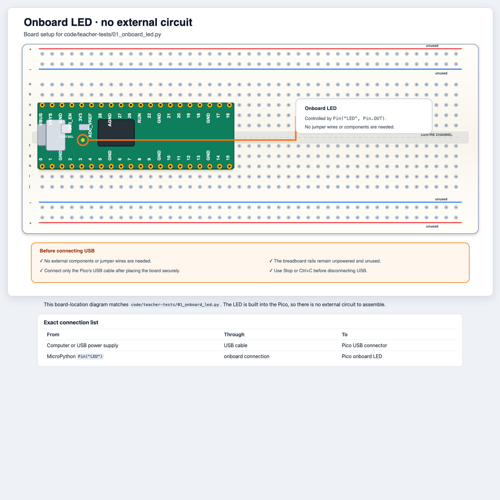
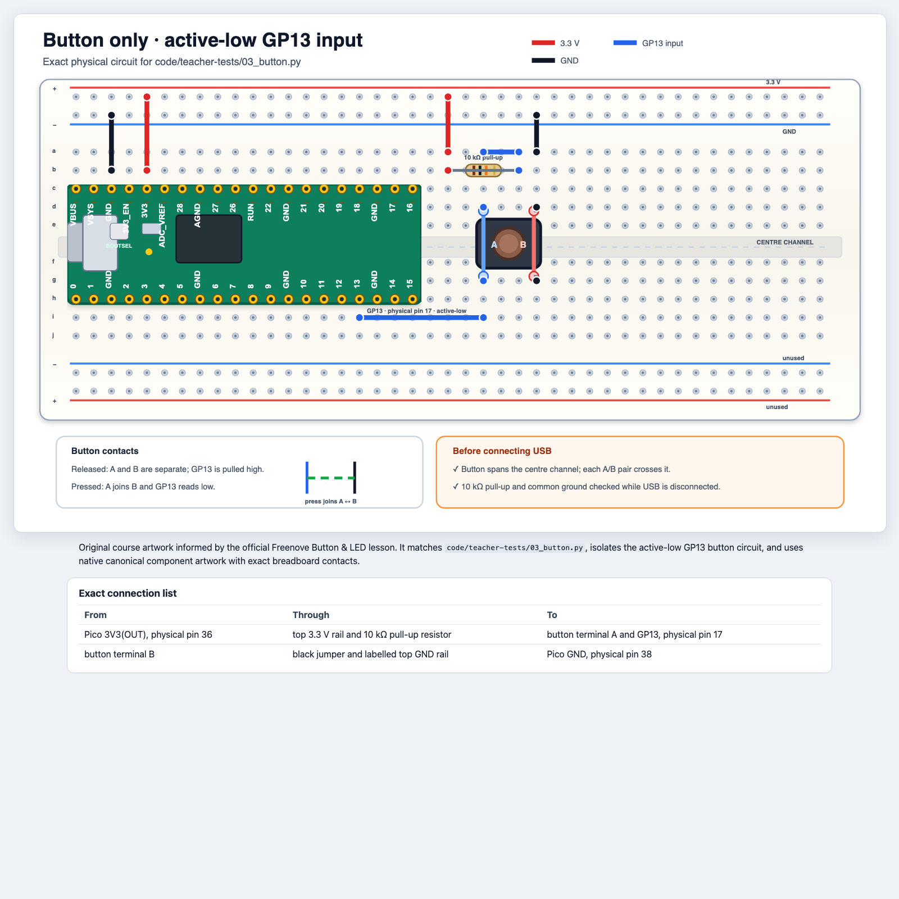
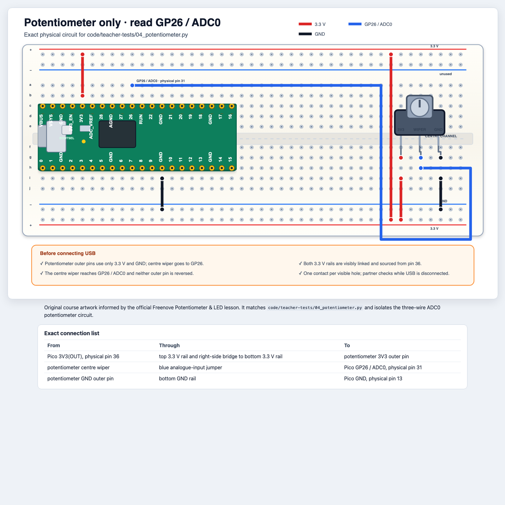

# Referenz zu Verkabelung und Sicherheit

Verwendet diese Datei als gemeinsame Sicherheits- und Pin-Referenz. Sie ist
**keine** zweite Bauanleitung. Folgt bei jeder Aktivität dem gerenderten
Diagramm in der jeweiligen Tageslektion und verwendet die genaue
Verbindungstabelle unter dem skalierbaren HTML-Diagramm.

## Regeln für jeden Aufbau

1. Stoppt das Programm und trennt USB, bevor ihr Kabel oder Bauteile verändert.
2. Baut nur nach dem Kursdiagramm für die aktuelle Aktivität.
3. Steckt nur ein Kabel oder Bauteilbein in jedes Breadboard-Loch.
4. Lasst eine Partnerin oder einen Partner jede Verbindung mit der Tabelle des
   Diagramms vergleichen.
5. Verwendet bei jeder normalen LED einen Vorwiderstand.
6. Verbindet VBUS (5 V) niemals mit einem GPIO oder direkt mit GND.
7. Verbindet alle Massepunkte, wenn eine Schaltung sowohl 3.3 V als auch 5 V
   verwendet.
8. Stoppt sofort, wenn etwas heiß wird oder ungewöhnlich riecht.
9. Haltet einen Buzzer nicht ans Ohr. Verwendet kurze, leise Töne.

Die GPIO-Pins des Pico arbeiten mit **3.3-V-Logik und vertragen keine 5 V**.

## Nach einem Kursdiagramm bauen

Jeder farbige Punkt in einem Diagramm markiert die Mitte eines echten
Breadboard-Lochs. Ein Kabel oder Bauteilbein endet in diesem Loch; zwei
physische Kontakte teilen sich niemals ein Loch.

1. **Bauteile bereitlegen.** Prüft Widerstandswerte und Bauteilnamen, bevor ihr
   etwas einsetzt.
2. **Pico ausrichten.** Richtet ihn wie im Kursdiagramm mit USB links aus.
3. **Bauteilgehäuse einsetzen.** Setzt Sensor, Taster, LED, Modul oder
   Transistor in der gezeigten Ausrichtung ein, bevor ihr Kabel ergänzt.
4. **Stromversorgung und Masse verbinden.** Eine farbige Schiene führt erst
   Strom, wenn ein Kabel sie sichtbar mit Pico `3V3(OUT)`, `VBUS` oder `GND`
   verbindet.
5. **Signalkabel und Widerstände ergänzen.** Folgt jeder farbigen Route von
   einem Punkt zum nächsten. Verwendet die HTML-Verbindungstabelle, wenn eine
   Route schwer zu erkennen ist.
6. **Polarität und Richtung prüfen.** Achtet auf LED `A/K`, Transistor `E/B/C`,
   die Pin-Namen des Sensors und den `IN`-Anschluss des RGB-Moduls.
7. **Bei getrennter Stromversorgung gegenseitig prüfen.** Lest die
   Verbindungstabelle laut vor, während die andere Person auf jeden physischen
   Kontakt zeigt.
8. **USB verbinden und den kleinsten Test ausführen.** Stoppt das Programm und
   trennt USB erneut, bevor ihr die Verkabelung korrigiert.

## Kurzübersicht zu Stromversorgung und Signalen

| Pico-Anschluss | Spannung oder Funktion | Sichere Verwendung |
|---|---|---|
| `VBUS` | etwa 5 V von USB | nur Stromversorgung für HC-SR04 und Buzzer |
| `3V3(OUT)` | geregelte 3.3 V | Potentiometer, RGB-Modul, Pull-up-Widerstände |
| GPIO | 3.3-V-Signal | im Programm benannter Ein- oder Ausgang |
| `GND` | 0-V-Bezug | gemeinsamer Rückleiter für alle Teile der Schaltung |

## In diesem Kurs verwendete Pico-Pins

| Signal | GPIO-Name | Physischer Pin |
|---|---:|---:|
| interne LED | `LED` | auf der Platine |
| externe LED / Buzzer-Steuerung | GP15 | 20 |
| Datenleitung des 8-RGB-Moduls | GP16 | 21 |
| HC-SR04-Echo-Eingang | GP18 | 24 |
| HC-SR04-Trigger-Ausgang | GP19 | 25 |
| analoger Potentiometer-Eingang | GP26 / ADC0 | 31 |
| 3.3 V | 3V3(OUT) | 36 |
| USB 5 V | VBUS | 40 |
| Masseanschlüsse in Diagrammen | GND | 13, 23 oder 38 |

GPIO-Nummern sind die in Python verwendeten Namen. Physische Pin-Nummern
bezeichnen die Positionen rund um die Platine. Verwendet immer genau den Pin,
der im aktuellen Diagramm genannt wird.

## Eingebaute LED

Für die eingebaute LED des Pico werden keine externen Bauteile oder
Jumper-Kabel benötigt. Das
[Diagramm der eingebauten LED](../../diagrams/onboard-led.html) markiert ihre
Position:

## Normale LED

Baut nach dem
[skalierbaren Diagramm für eine normale LED](../../diagrams/ordinary-led.html)
in [Tag 1](day-1-make-it-light.md#4-baut-eine-externe-led).

| Von | Über | Nach |
|---|---|---|
| GP15 | 220-Ω-Widerstand | langes Anodenbein der LED |
| kurzes Kathodenbein / flache Seite der LED | untere GND-Schiene | Pico GND |

Vor dem Einschalten: Prüft, dass der Widerstand vorhanden ist und das lange
LED-Bein zum Widerstand zeigt.

## Taster

Baut nach dem
[skalierbaren Taster-und-LED-Diagramm](../../diagrams/button-and-led.html) in
[Tag 2](day-2-make-it-decide.md#1-ein-taster-stellt-eine-boolean-frage).
Verwendet für den einzelnen Eingangstest der Lehrkraft das
[Nur-Taster-Diagramm](../../diagrams/button-only.html):

Ein vierbeiniger Kurzhubtaster besitzt nur zwei elektrische Anschlüsse. Die
beiden Beine von Anschluss A sind immer verbunden; ebenso die beiden Beine von
Anschluss B. Beim Drücken werden A und B verbunden. Der Taster muss in der
gezeigten Ausrichtung über dem Mittelkanal des Breadboards sitzen.

| Teil | Verbindung |
|---|---|
| Tastersignal | GP13 |
| Pull-up | 10 kΩ von GP13 zu 3.3 V |
| anderer Tasteranschluss | GND |
| externe LED | GP15 über 220 Ω zur LED, dann GND |

Vor dem Einschalten: Verwendet nach Möglichkeit den Durchgangsprüfmodus. Ein
Beinpaar desselben Anschlusses muss im ungedrückten Zustand verbunden sein; A
und B dürfen nur beim Drücken verbunden sein.

## Potentiometer und PWM-LED

Baut nach dem
[skalierbaren Potentiometer-und-LED-Diagramm](../../diagrams/potentiometer-and-led.html)
in [Tag 2](day-2-make-it-decide.md#2-von-der-analogen-welt-zu-zahlen).
Verwendet für den einzelnen ADC-Test der Lehrkraft das
[Nur-Potentiometer-Diagramm](../../diagrams/potentiometer-only.html):

| Teil | Verbindung |
|---|---|
| äußerer Potentiometer-Pin `3V3` | 3.3 V |
| mittlerer Potentiometer-Pin `WIPER` | GP26 / ADC0 |
| äußerer Potentiometer-Pin `GND` | GND |
| LED | GP15 über 220 Ω zur LED, dann GND |

Verwendet am Potentiometer ausschließlich 3.3 V. Beim Drehen bewegt sich der
mittlere Schleifer zwischen 0 V und 3.3 V.

## Freenove 8-RGB-LED-Modul

Baut nach dem
[skalierbaren Diagramm des 8-RGB-Moduls](../../diagrams/rgb8-module.html) in
[Tag 3](day-3-make-it-reusable.md#1-lernt-das-rgb-modul-kennen).

Verbindet den mit **IN** gekennzeichneten Anschluss, nicht OUT:

| Modul-Pin | Pico |
|---|---|
| `IN S` | GP16 |
| `IN V` | 3.3 V |
| `IN G` | GND |

Die Beispiele verwenden bewusst niedrige RGB-Werte, um Blendung und
Stromaufnahme zu verringern.

## Passiver Buzzer mit Transistortreiber

Baut nach dem
[skalierbaren Diagramm für den passiven Buzzer](../../diagrams/passive-buzzer.html)
in [Tag 4](day-4-make-it-sense.md#3-testet-den-passiven-buzzer).

| Von | Über | Nach |
|---|---|---|
| GP15 | 1-kΩ-Widerstand | S8050-Basis `B` |
| VBUS / 5 V | passiver Buzzer | S8050-Kollektor `C` |
| S8050-Emitter `E` | GND-Schiene | Pico GND |

Steuert den Buzzer nicht direkt über einen GPIO an. Prüft vor dem Einsetzen des
Transistors die im Diagramm gezeigte flache Seite und die Reihenfolge `E/B/C`.

## HC-SR04-Abstandssensor: sicherere Echo-Verbindung

Baut nach dem
[skalierbaren sicheren HC-SR04-Diagramm](../../diagrams/distance-sensor.html) in
[Tag 4](day-4-make-it-sense.md#sicherheitskontrolle).

Der HC-SR04 verwendet 5 V, daher kann Echo fast 5 V erreichen. Dieser Kurs
ersetzt die offizielle direkte Echo-Verbindung bewusst durch einen
Spannungsteiler:

| HC-SR04-Pin | Verbindung |
|---|---|
| VCC | VBUS / 5 V, physischer Pin 40 |
| Trig | GP19, physischer Pin 25 |
| Echo | über **1 kΩ** zum Knoten des Spannungsteilers |
| Knoten des Spannungsteilers | GP18 und über **2 kΩ** zu GND |
| GND | Pico GND |

Der Spannungsteiler erzeugt ungefähr `5 V × 2/(1+2) = 3.33 V`. Eine Lehrkraft
sollte jede stromlose Sensorschaltung prüfen, bevor USB verbunden wird.

## Kombinierte Schaltungen

Das [Diagramm des Näherungsalarms von Tag
4](../../diagrams/proximity-alarm.html) kombiniert den geschützten Sensor und
den über einen Transistor angesteuerten Buzzer. Die
[Parkassistenten-Lektion von Tag 5](day-5-parking-assistant.md) ergänzt das
8-RGB-Modul an GP16 und hält seine 3.3-V-Versorgung von der
5-V-Sensor- und Buzzer-Versorgung getrennt.

| Bauteil | Signal | Stromversorgung |
|---|---|---|
| HC-SR04 | Trig GP19; geteiltes Echo an GP18 | 5 V und GND |
| Treiber für passiven Buzzer | GP15 über 1 kΩ zur Basis | 5 V und GND |
| `IN` des 8-RGB-Moduls | GP16 | 3.3 V und GND |

In diesem Plan gibt es keine GPIO-Konflikte.

## Quellenhinweis

Die Kursdiagramme sind eigenständige Vektorgrafiken, die sich an den
offiziellen Freenove-Lektionen orientieren. Quellenlinks und Bildnachweise sind
unter [Quellen, Bilder und Nachweise](../../SOURCES_AND_IMAGES.md)
zusammengefasst. Das offizielle HC-SR04-Bild dient nur als sachliche Referenz;
die Lernenden müssen das sicherere Kursdiagramm mit Echo-Spannungsteiler
verwenden.
