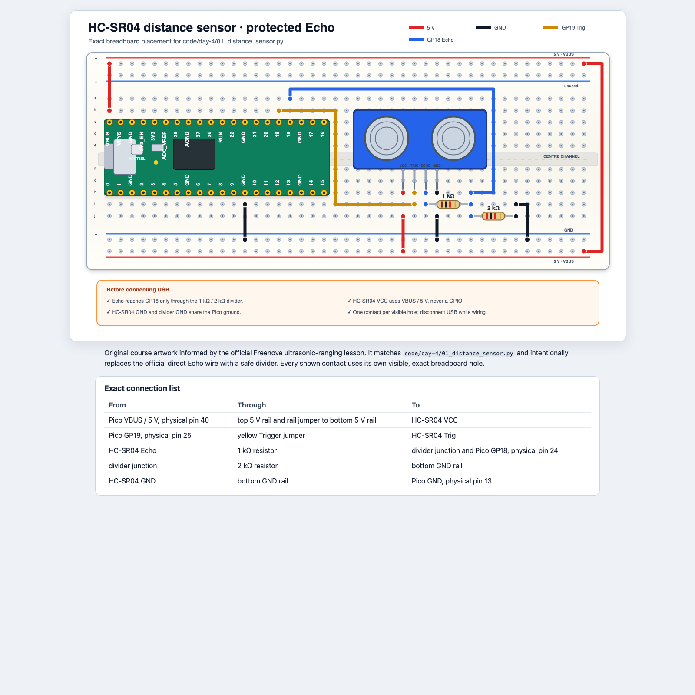
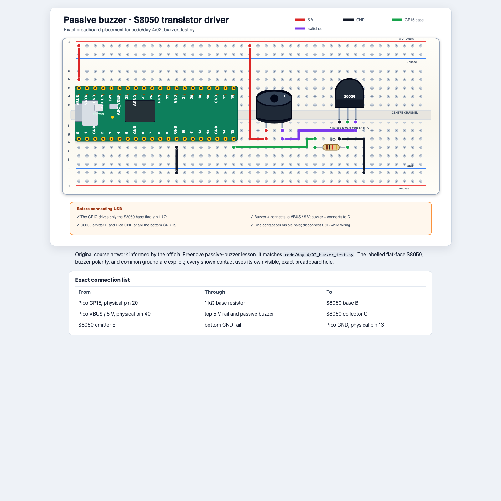
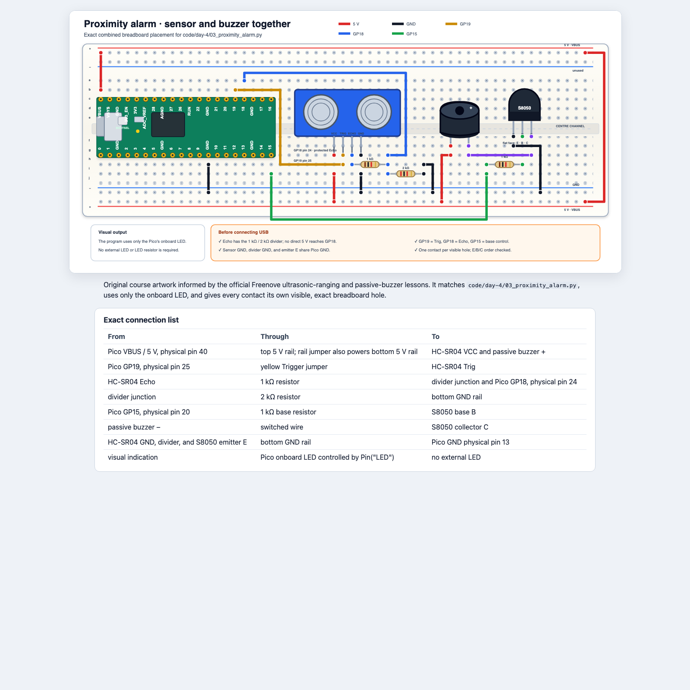

# Tag 4: Sensoren nutzen

## Mission

Messt sicher Entfernungen, behandelt unzuverlässige Daten und baut den
Prototyp eines Alarms.

**Python:** Sensorfunktionen, Rückgabewerte, `None`, Dictionaries, Timeouts,
Anforderungen, Testfälle<br>
**Hardware:** HC-SR04, passiver Buzzer und NPN-Treiber<br>
## Sicherheitskontrolle

Der HC-SR04 arbeitet mit 5 V, aber die GPIO-Pins des Pico vertragen nur 3.3 V.
Ihr müsst den unter
[Verdrahtung und Sicherheit](WIRING_AND_SAFETY.md#hc-sr04-abstandssensor-sicherere-echo-verbindung)
beschriebenen 1-kΩ/2-kΩ-Spannungsteiler für Echo einbauen. Die direkte
Echo-Verbindung aus dem offiziellen Freenove-Schaltplan wird **nicht**
verwendet. Baut nach dem Kursschaltplan unten. Öffnet die
[skalierbare, barrierearme Version](../../diagrams/distance-sensor.html), um
jeden Kontakt und die genaue Anschlusstabelle zu prüfen.



Zum Vergleich und als Quellenangabe findet ihr hier den offiziellen
[HC-SR04-Aufbau](https://docs.freenove.com/projects/fnk0063/en/latest/_images/Chapter22_06.png)
und die Freenove-Lektion
[Ultrasonic Ranging](https://docs.freenove.com/projects/fnk0063/en/latest/fnk0063/codes/Python/22_Ultrasonic_Ranging.html).
Der lokale Schaltplan ist eine eigene Kursgrafik auf Grundlage dieser Quelle.

Eine Lehrkraft muss die stromlose Schaltung prüfen, bevor USB verbunden wird.
Holt den HC-SR04, einen 1-kΩ-Widerstand, einen 2-kΩ-Widerstand und
Jumper-Kabel. Setzt Sensor und beide Widerstände ein, bevor ihr 5 V verbindet.
Prüft mit der Anschlusstabelle:
`Echo → 1 kΩ → GP18 junction → 2 kΩ → GND`.

## 1. Messt Hin- und Rückweg

Führt [`code/day-4/01_distance_sensor.py`](../../code/day-4/01_distance_sensor.py)
aus. Der Sensor sendet einen Ultraschallimpuls und misst die Zeit bis zu seiner
Rückkehr:

```text
distance = speed × round-trip time ÷ 2
```

Der Code verwendet einen Timeout. Ohne ihn könnte ein ausbleibendes Echo das
Programm für immer in einer Schleife festhalten.

Der vorgegebene `try`/`finally`-Code setzt Trigger beim Programmende auf low.
Er ist ein Sicherheitsgerüst. Eure Aufgaben heute sind die Sensorfunktion,
`None`, Entscheidungen und Testergebnisse.

Messt einen flachen Gegenstand bei 10, 20, 40, 60 und 100 cm:

| Abstand am Lineal | Messung 1 | Messung 2 | Messung 3 | Abweichung |
|---:|---:|---:|---:|---:|
| 10 cm | | | | |
| 20 cm | | | | |
| 40 cm | | | | |
| 60 cm | | | | |
| 100 cm | | | | |

Probiert einen weichen und einen schräg gehaltenen Gegenstand. Warum verändern
sich die Messwerte?

## 2. „Keine Messung“ darstellen

`measure_distance_cm()` gibt entweder eine Gleitkommazahl oder `None` zurück.

```python
distance = measure_distance_cm()

if distance is None:
    print("No echo")
else:
    print(distance)
```

`None` ist ehrlicher, als bei einer ungültigen Messung null vorzutäuschen.
Null würde fälschlich „gefährlich nah“ bedeuten.

## 3. Testet den passiven Buzzer

Trennt USB. Baut die Transistortreiberschaltung aus
[Verdrahtung und Sicherheit](WIRING_AND_SAFETY.md#passiver-buzzer-mit-transistortreiber).

Öffnet den
[skalierbaren, barrierearmen Buzzer-Schaltplan](../../diagrams/passive-buzzer.html).
Dort findet ihr die genaue Anschlusstabelle, die Transistorausrichtung und die
Kontrollen vor dem Einschalten.



Zum Vergleich und als Quellenangabe findet ihr hier die offizielle
[Freenove-Buzzer-Schaltung](https://docs.freenove.com/projects/fnk0063/en/latest/_images/Chapter07_11.png)
und die
[Buzzer-Lektion](https://docs.freenove.com/projects/fnk0063/en/latest/fnk0063/codes/Python/7_Buzzer.html).
Der lokale Schaltplan ist eine eigene Kursgrafik auf Grundlage dieser Quelle.

Führt [`code/day-4/02_buzzer_test.py`](../../code/day-4/02_buzzer_test.py) aus.
Beginnt mit kurzen Tönen und einem niedrigen PWM-Tastgrad. Eine Teilnahme nur
mit visuellen Signalen ist immer möglich.

## 4. Ein Dictionary speichert Einstellungen

Beginnt in der Shell mit einem Dictionary:

```python
zone = {"colour": "amber", "pause_ms": 600}
print(zone["colour"])
zone["pause_ms"] = 400
print(zone)
```

Ein Dictionary speichert **Schlüssel-Wert-Paare**. Der Schlüssel `"pause_ms"`
findet seinen Wert; eine Zuweisung über diesen Schlüssel ändert die
Einstellung. Mehrere zusammengehörige Dictionaries können anschließend nach
Zustand gruppiert werden:

```python
ZONE_CONFIG = {
    "safe": {"beep_ms": 0, "pause_ms": 300},
    "caution": {"beep_ms": 80, "pause_ms": 520},
    "stop": {"beep_ms": 80, "pause_ms": 120},
    "invalid": {"beep_ms": 0, "pause_ms": 300},
}

print(ZONE_CONFIG["caution"]["pause_ms"])
```

Für eine geänderte Konfiguration sollte die Messlogik nicht neu geschrieben
werden müssen.

## Tagesprojekt: Prototyp eines Näherungsalarms

Führt
[`code/day-4/03_proximity_alarm.py`](../../code/day-4/03_proximity_alarm.py)
aus. Heute liefern die Shell und die eingebaute LED sichtbare Informationen;
morgen ersetzt das RGB-Modul sie.

Baut beide Schaltungen gemeinsam nach dem
[skalierbaren, barrierearmen Schaltplan des Näherungsalarms](../../diagrams/proximity-alarm.html).
Er verwendet GP19 für Trigger, den geschützten GP18 für Echo, GP15 zur
Buzzer-Steuerung und die eingebaute LED des Pico. Eine externe LED ist nicht
nötig.



Baut schichtweise:

1. Stoppt die einzelnen Tests und trennt USB.
2. Lasst den geprüften Sensor-Spannungsteiler an seinem Platz und ergänzt die
   Buzzer-Schaltung an den Positionen des kombinierten Schaltplans.
3. Vergleicht jede Verbindung mit der HTML-Tabelle.
4. Lasst 5 V, Spannungsteiler, Transistor `E/B/C` und gemeinsame Masse von
   einer Lehrkraft prüfen.
5. Verbindet USB wieder und führt die einzelnen Sensor- und Buzzer-Tests erneut
   aus, bevor ihr das kombinierte Programm startet.

Wählt Grenzwerte und dokumentiert sie:

| Zustand | Entfernungsregel | LED | Ton |
|---|---|---|---|
| safe | | | |
| caution | | | |
| stop | | | |
| invalid | kein Echo | | |

Anforderungen:

- `measure_distance_cm()` gibt eine Zahl oder `None` zurück.
- `classify_distance()` gibt einen Zustands-String zurück.
- Ungültige Eingaben dürfen nie einen Daueralarm auslösen.
- Der Ton wird dringlicher, je näher der Gegenstand kommt.
- Nach `Ctrl+C` sind LED und Buzzer aus.

## Plant das Produkt für morgen

Schreibt vier User Stories:

- „Wenn das Hindernis weit entfernt ist, möchte ich ___, damit ___.“
- „Wenn ich den caution-Bereich erreiche, möchte ich ___, damit ___.“
- „Wenn ich anhalten muss, möchte ich ___, damit ___.“
- „Wenn der Sensor nichts messen kann, möchte ich ___, damit ___.“

Schreibt danach Testfälle mit genauen Entfernungen, erwarteten Farben und
erwartetem Ton. Grenzwerte wie genau 25 cm sind besonders wichtig.

## Abschlussfrage

Warum gehört ein Timeout zum korrekten Verhalten und ist nicht nur ein
optionaler Zusatz?
