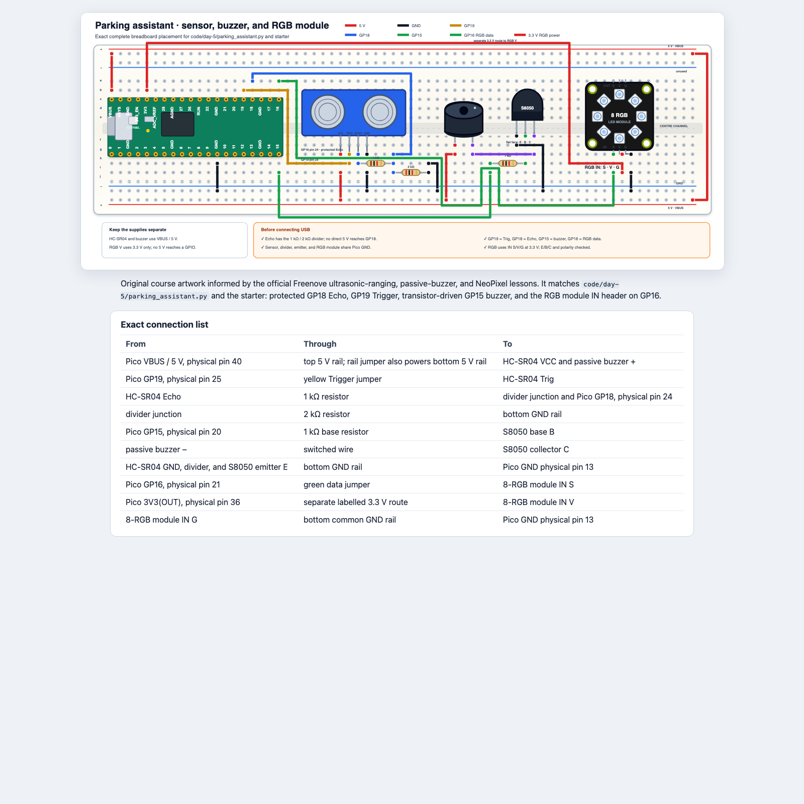

# Tag 5: Einen Parkassistenten bauen

## Mission

Verbindet Sensorik, Entscheidungen, Licht und Ton zu einem testbaren Produkt.

**Python:** Zerlegung, Dictionaries, Zustand, Integration, Grenzwerttests,
Debugging, Aufräumen<br>
**Hardware:** HC-SR04, Treiberschaltung für passiven Buzzer, 8-RGB-Modul<br>
Dies ist ein Lernprototyp für den Tisch, **kein Sicherheitssystem für echte
Fahrzeuge**.

## 1. In Schichten aufbauen

Verwendet den kombinierten Pin-Plan unter
[Verkabelung und Sicherheit](WIRING_AND_SAFETY.md#kombinierte-schaltungen).
Lasst USB getrennt, bis eine Lehrkraft den HC-SR04-Spannungsteiler, die
5-V-Verkabelung, die Ausrichtung des Transistors und die gemeinsame Masse
geprüft hat.

Baut nach dem
[skalierbaren, barrierefreien Gesamtschaltbild des Parkassistenten](../../diagrams/parking-assistant.html).
Es enthält den geschützten HC-SR04, den über einen Transistor angesteuerten
passiven Buzzer und den `IN`-Anschluss des 8-RGB-Moduls mit eigener
3,3-V-Versorgung.



Dieses eigens für den Kurs erstellte Diagramm orientiert sich an den offiziellen
Freenove-Lektionen zu Ultraschallmessung, Buzzer und NeoPixel.

| Bauteil | Signal | Stromversorgung |
|---|---|---|
| HC-SR04 | Trig GP19; Echo über Spannungsteiler an GP18 | 5 V und GND |
| Treiber für passiven Buzzer | GP15 über 1 kΩ zur NPN-Basis | 5 V und GND |
| `IN` des 8-RGB-Moduls | GP16 | 3.3 V und GND |

Verdrahtet nicht alles auf einmal und startet dann sofort die abschließende
Endlosschleife. Baut und testet jeweils eine Schicht:

1. Baut bei getrenntem USB den HC-SR04 und den Echo-Spannungsteiler an den
   Positionen des endgültigen Diagramms auf. Lasst die Schaltung prüfen und
   führt dann den Abstandstest von Tag 4 aus.
2. Stoppt das Programm, trennt USB und ergänzt den über einen Transistor
   angesteuerten Buzzer. Verbindet USB erst nach der Prüfung von `E/B/C` wieder
   und führt dann den Buzzer-Test von Tag 4 aus.
3. Stoppt das Programm, trennt USB und ergänzt den `IN`-Anschluss des RGB-Moduls
   mit 3.3 V. Führt den RGB-Farbtest von Tag 3 aus.
4. Stoppt das Programm und vergleicht den gesamten Aufbau mit der
   Verbindungstabelle im abschließenden HTML-Diagramm. Lasst 5 V, 3.3 V, den
   Spannungsteiler und die gemeinsame Masse ein letztes Mal prüfen.
5. Testet `classify_distance()` mit festen Zahlen, bevor ihr echte Messwerte
   verwendet.
6. Verbindet Messung und RGB-Ausgabe zunächst mit stummgeschaltetem Ton.
7. Ergänzt kurze Buzzer-Signale und testet dann ungültige Eingaben, indem ihr
   den Sensor von geeigneten Zielen weg richtet.

## 2. Anforderungen vereinbaren

Die bereitgestellte Ausgangsversion verwendet:

| Zustand | Regel | RGB-Anzeige | Ton |
|---|---|---|---|
| safe | über 60 cm | grün | stumm |
| caution | über 25 cm bis einschließlich 60 cm | bernsteinfarben | langsames Piepen |
| stop | 25 cm oder weniger | rot | schnelles Piepen |
| invalid | kein nutzbares Echo | blau | stumm |

Ihr dürft die Grenzwerte nach der Kalibrierung anpassen, müsst die Änderung aber
dokumentieren.

## 3. Die Architektur verstehen

```python
distance_cm = measure_distance_cm()
zone = classify_distance(distance_cm)
show_zone(zone, distance_cm)
sound_zone(zone)
```

Jede Funktion hat eine Hauptaufgabe. Dadurch lassen sich Fehler leichter
eingrenzen.

Beginnt mit
[`code/day-5/parking_assistant_starter.py`](../../code/day-5/parking_assistant_starter.py).
Verwendet [`code/day-5/parking_assistant.py`](../../code/day-5/parking_assistant.py)
nur zum Vergleichen, zur Wiederherstellung oder für eine Demonstration der
Lehrkraft.

Die Starterdatei enthält bewusst bereits Imports, Pin-Konfiguration, Aufräumen
und Funktionsnamen. Ihr ergänzt die Logik mit bereits behandelten Konzepten:
Bedingungen, Funktionen, Rückgabewerte, Schleifen und Dictionary-Zugriffe.

## 4. Gefordertes Verhalten

- Verwendet benannte Konstanten für Pins und Grenzwerte.
- Behandelt ein fehlendes Echo, ohne dass das Programm einfriert.
- Verwendet ein Dictionary für Farben oder Zeitwerte der Zustände.
- Zeigt die Zustände safe, caution, stop und invalid sichtbar an.
- Erhöht die optische Dringlichkeit, wenn der Abstand kleiner wird.
- Erhöht die Dringlichkeit des Pieptons, wenn der Abstand kleiner wird.
- Die Zustände safe und invalid bleiben stumm.
- Gebt Abstand und Zustand als Testnachweis aus.
- Schaltet RGB-Ausgabe und PWM nach `Ctrl+C` aus.

## 5. Erst testen, dann ausschmücken

| Test | Eingabe/Aufbau | Erwartet | Tatsächlich | Bestanden? |
|---|---|---|---|---|
| T1 | flaches Ziel bei 100 cm | safe, grün, stumm | | |
| T2 | flaches Ziel bei 40 cm | caution, bernsteinfarben, langsames Piepen | | |
| T3 | flaches Ziel bei 15 cm | stop, rot, schnelles Piepen | | |
| T4 | kein nutzbares Echo | invalid, blau, stumm | | |
| T5 | genau am safe-Grenzwert | vereinbartes Verhalten am Grenzwert | | |
| T6 | genau am stop-Grenzwert | vereinbartes Verhalten am Grenzwert | | |
| T7 | Programm stoppen | alle Ausgaben aus | | |

Wenn ein Test fehlschlägt, grenzt den Fehler auf ein Bauteil ein. Schreibt nicht
das gesamte Programm neu.

## 6. Produkt-Challenge

Wenn die Ausgangsversion alle Tests besteht, wählt **eine** sinnvolle
Verbesserung:

- eine Abstandsanzeige, bei der mehr Pixel leuchten, je näher das Hindernis
  kommt;
- ein Potentiometer zum Einstellen des caution-Grenzwerts;
- einen Stummmodus, bei dem die optischen Warnungen aktiv bleiben;
- eine Glättung mit den letzten fünf gültigen Messwerten;
- unterschiedliche Töne zusätzlich zu unterschiedlichen Piepraten;
- einen Selbsttest beim Start, der jede Farbe und jeden Ton prüft;
- ein Gehäuse oder Armaturenbrett aus Karton mit freien Sensoröffnungen.

Den Umfang zu begrenzen ist eine Programmierkompetenz. Eine zuverlässige
Verbesserung ist besser als fünf unfertige Ideen.

## 7. Abschlusspräsentation

Jedes Paar hat drei Minuten:

1. Beschreibt das Problem der Nutzenden und die Sicherheitsgrenze.
2. Demonstriert die Fälle safe, caution, stop und invalid.
3. Zeigt einen Grenzwerttest.
4. Erklärt eine Funktion mit Parameter und Rückgabewert.
5. Beschreibt einen Fehler und den Nachweis, mit dem ihr ihn behoben habt.
6. Nennt die nächste Verbesserung.

## Reflexion

- Welches Programmierkonzept wurde klarer, weil ihr es sehen oder hören
  konntet?
- Welcher Fehler lag im Code, welcher in der Verkabelung und welcher in einer
  Annahme?
- Wo speichert euer Programm Zustand oder Konfiguration?
- Wie müssten sich die Anforderungen für ein echtes Produkt ändern?
