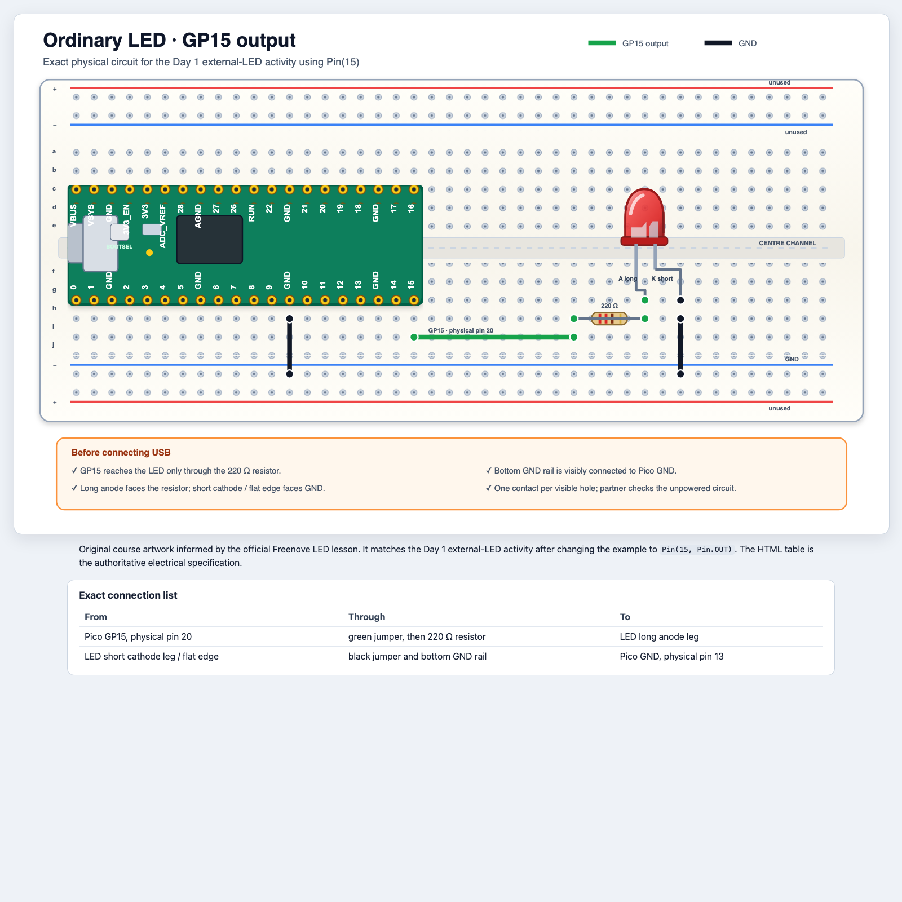

# Day 1: Make It Light

## Mission

By the end of today, your code will send a secret message using light.

**Python:** interpreter, script, `print`, strings, integers, floats, variables,
assignment, comments, imports, errors<br>
**Hardware:** onboard LED, external LED, GPIO output<br>
**TEALS connection:** Unit 1, Introduction to Python

## 1. Meet the interpreter

In Thonny's Shell, type one line at a time:

```python
print("Hello, Pico!")
2 + 3
type("hello")
type(42)
type(0.5)
```

Discuss:

- A string is text in quotes.
- An integer is a whole number.
- A float contains a decimal point.
- An expression produces a value.
- An interpreter runs code.

Make three intentional errors. Read the final line of each error message:

```python
print("missing quote)
pritn("misspelled name")
10 / 0
```

Errors are information, not failure.

## 2. Your first physical program

Open [`code/day-1/01_hello_pico.py`](../../code/day-1/01_hello_pico.py).

Before running it, predict the order of the printed messages and LED changes.
Then change the words and delay.

```python
from machine import Pin
from time import sleep

led = Pin("LED", Pin.OUT)

print("Three...")
led.on()
sleep(1)
print("Two...")
led.off()
sleep(1)
print("One...")
led.on()
print("Hello, physical world!")
```

`Pin("LED", Pin.OUT)` creates an output object. Calling `led.on()` changes a
voltage, which changes the real world.

## 3. Variables are labelled storage

Run [`code/day-1/02_variable_blink.py`](../../code/day-1/02_variable_blink.py).

Change only these values:

```python
message = "Team Comet"
on_time = 0.15
off_time = 0.35
```

Which change affects text, and which changes affect timing? Why are the timing
values floats rather than strings?

The file repeats three similar blocks of code on purpose. Do not worry about
shortening them yet. On Day 3, you will learn loops and functions that remove
this kind of repetition.

## 4. Build an external LED

Disconnect USB first.

Open the
[scalable, accessible ordinary-LED diagram](../../diagrams/ordinary-led.html) and
build from its exact connection table.



Reconnect only after both partners check:

- GP15 goes through a 220 Ω resistor to the LED;
- the LED's long and short legs are correctly oriented;
- GND and GP15 are not directly connected.

Make a copy of `code/day-1/02_variable_blink.py`. In the copy, replace
`Pin("LED", Pin.OUT)` with `Pin(15, Pin.OUT)`, then run the smallest external
LED test before changing the pattern.

## 5. Debugging relay

Your teacher will give each pair one fault:

- missing parenthesis;
- wrong capital letter;
- wrong pin number;
- LED reversed;
- one wire one row away;
- code still running from a previous test.

Describe the symptom, make one test, and record the evidence. Do not randomly
change code and wiring together.

## Daily build: Secret Signal Machine

Invent a signal with:

- a printed team name;
- at least two named timing variables;
- short and long flashes;
- a clear pause between groups of flashes;
- comments explaining the message;
- a clean final `off` state.

Start from
[`code/day-1/03_secret_signal_starter.py`](../../code/day-1/03_secret_signal_starter.py).
Do not open the solution until your own message works.

Possible themes: space beacon, robot greeting, lighthouse, goal celebration, or
Morse-code initials.

### Demo checklist

- Can another team tell where one group of flashes ends and the next begins?
- Can you change speed by editing only variables?
- Can you explain the difference between the program and the output?

## Exit ticket

Complete this sentence: “When Python runs `led.on()`, the output is ___, and
when Python runs `print()`, the output is ___.”
