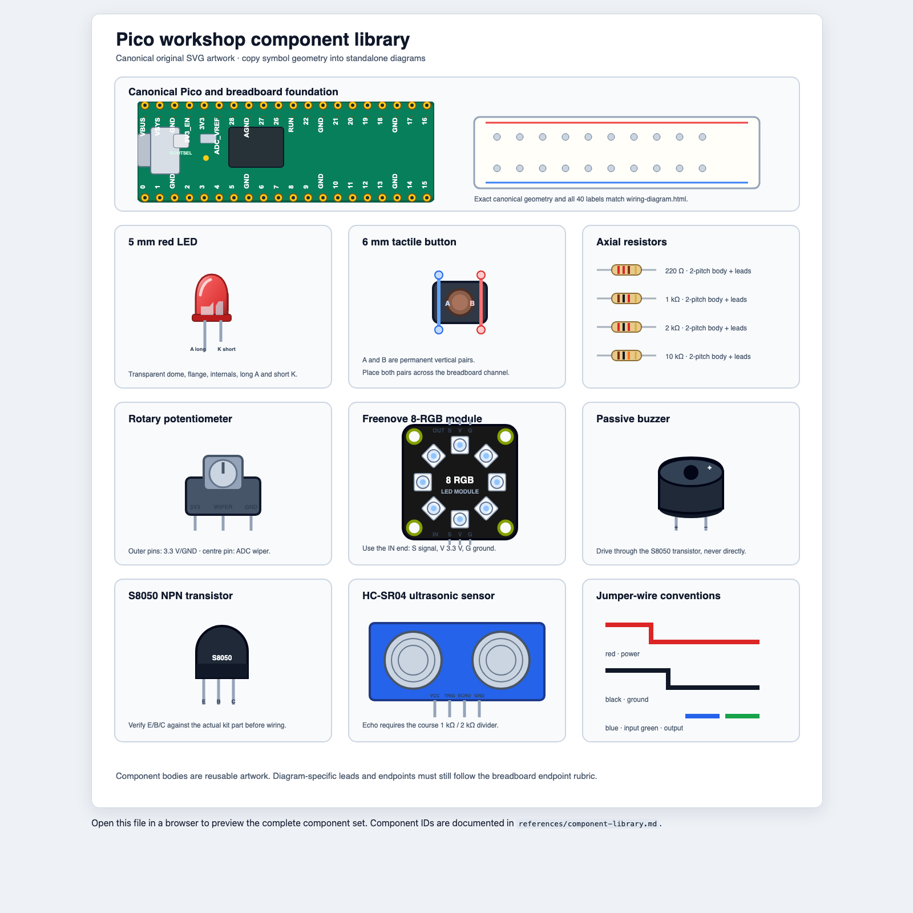

# SVG Component Library

The canonical preview and source artwork is:

```text
templates/components.html
```



It contains inline SVG `<symbol>` definitions. Copy the required symbol
definition into a standalone diagram's `<defs>`, then instantiate it with
`<use href="#component-id">`. Do not link finished course diagrams to the
gallery because every diagram must remain self-contained.

## Required workshop components

| Symbol ID | Workshop use | Required details |
|---|---|---|
| `component-pico` | every breadboard circuit | Exact `520 × 192 px` canonical footprint, board details, 40 pads, and all silkscreen labels from `wiring-diagram.html` |
| `component-led-5mm-red` | external LED and PWM activities | Translucent dome, flange, visible internals, long anode and short cathode |
| `component-button-6mm` | button and reaction game | Left A pair, right B pair, four visible contacts |
| `component-resistor-220` | LED current limiting | red-red-brown-gold |
| `component-resistor-1k` | buzzer base and Echo divider | brown-black-red-gold |
| `component-resistor-2k` | Echo divider | red-black-red-gold |
| `component-resistor-10k` | button pull-up | brown-black-orange-gold |
| `component-potentiometer` | ADC and threshold activities | 3V3, wiper, and GND pins |
| `component-rgb8-module` | Pixel Pet and parking assistant | square black PCB, four mounting holes, eight radial pixels, and separate labelled S/V/G IN and OUT headers |
| `component-passive-buzzer` | proximity sound | polarity marks and two leads |
| `component-s8050` | buzzer driver | flat face, S8050 marking, and E/B/C labels |
| `component-hcsr04` | distance measurement | two transducers and VCC/Trig/Echo/GND labels |

The gallery also demonstrates the canonical breadboard appearance and jumper
wire colours.

## Canonical scale

Every component must be instantiated at the native width and height declared
by its symbol `viewBox`. Do not resize a component to make a particular layout
easier; move it or choose different breadboard holes instead.

All axial resistor symbols are exactly `104 × 24 px`. The tan body is `52 px`
long—two horizontal breadboard pitches. A light-grey metal lead extends
`26 px`, one pitch, from each side. The lead endpoints are therefore four
pitches (`104 px`) apart. Every resistor instance must use
`width="104" height="24"` without a scaling transform.

## Placement rules

- Treat component artwork as the visual body, not as proof of connectivity.
- Draw diagram-specific leads in `#circuit-connections`.
- Put every breadboard-contacting endpoint exactly on a visible hole centre.
- Use each component at its canonical unscaled dimensions; do not override
  its native width or height.
- Do not recolour pins or polarity marks in a way that changes their meaning.
- Keep labels visible; move the whole component rather than hiding a label.
- For the LED, preserve the flat cathode side, shorter cathode lead, internal
  anvil/post, and explicit `A long` / `K short` labels.
- For the tactile button, preserve the left/right permanent-pair orientation.
- For the 8-RGB module, preserve the square PCB, radial eight-pixel layout,
  four mounting holes, and distinct IN/OUT headers. Do not render it as a
  linear LED strip.

The RGB module's physical organization is based on the
[official Freenove NeoPixel documentation](https://docs.freenove.com/projects/fnk0063/en/latest/fnk0063/codes/Python/6_NeoPixel.html);
the SVG artwork is original and does not copy Freenove branding or pixels.
